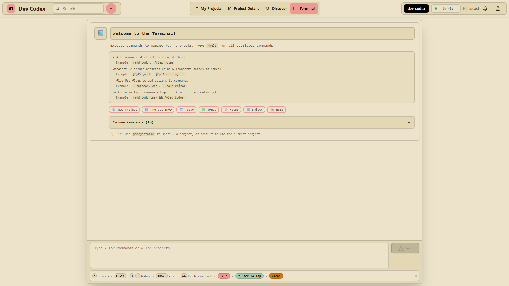

# Dev Codex

**Project management at the speed of thought.**

Stop clicking through UIs. Use a terminal. Or don't—it's optional. Either way, manage projects faster than ever!

[](https://www.typescriptlang.org/)
[](https://reactjs.org/)
[](https://nodejs.org/)
[](https://www.mongodb.com/)
[](https://github.com/LFroesch/project-management)

---

## 🆓 Free & Open Source

**Clone it. Deploy it. It's yours. No strings attached.**

### Two Options:

**1. Self-Host (Free Forever)**
- Deploy anywhere (Railway, DO, AWS, your server)
- Set `SELF_HOSTED=true` → unlimited everything, no rate limits
- You control the data, infrastructure, and costs

**2. Use the Hosted Version**
- Production instance at [TBA]
- Optional paid plans for convenience
- Same features, but I handle deployment & monitoring
- Free tier: 3 projects to try it out

**Choose your path.** Self-hosting = control. Hosted = convenience. Both get the same great software.

---

## The Magic: LLM-Powered Workflow



**Dev Codex has a full CLI built into the browser.** Here's the workflow that sets it apart:

1. **Export your project context to any LLM:**
```bash
/summary prompt all          # Full project context
/summary json todos         # Just your todos
/llm                        # Get command syntax reference
```

2. **Paste into ChatGPT/Claude:**
```
"Build a recipe app with auth, CRUD, and meal planning.
Todos: auth setup, recipe model, UI, filters
Stack: Next.js, PostgreSQL, Prisma, NextAuth
Invite sarah@team.com as editor

[paste /llm output for command syntax]"
```

3. **LLM generates batch commands. Copy and paste back:**
```bash
/add todo --title="Setup authentication" --priority=high --status=in_progress
/add todo --title="Create recipe model" --priority=high
/add note --title="Architecture" --content="Next.js 14, Prisma ORM, PostgreSQL"
/add component --feature="Auth" --category=backend --title="Auth Service"
...and 10 more commands
```

**Instant project structure.** Then export again with `/summary prompt all` for iteration. It's bidirectional.

*Future: Paid in-app AI. For now, BYO LLM key.*

### Other Ways to Use the Terminal

- **Interactive Wizards:** `/wizard project` → guided forms
- **Learn the Syntax:** Autocomplete, validation, command chaining
- **Skip It Entirely:** Use the traditional UI—all features available via clicks

---

## Core Features

**Projects:**
- Todos, notes, dev logs, components (with relationships), tech stack tracking
- Import/Export JSON (100MB, sanitized)

**Team Collaboration:**
- Owner/Editor/Viewer roles, email invites, real-time notifications
- Note locking (10-min heartbeat), Socket.io updates, activity logs

**Analytics:**
- Real-time session tracking (10s heartbeats, 5-min idle detection)
- Per-project time breakdown, heatmaps, leaderboards

**Public Discovery:**
- Custom slugs: `/public/project/@username/project-slug`
- Granular visibility control, searchable project directory

**Admin Tools:**
- User management, support tickets, analytics, database cleanup, news posts

---

## Tech Stack

**Frontend:** React 18 + TypeScript + Vite | Tailwind + DaisyUI | TanStack Query | Socket.io | ReactFlow

**Backend:** Node.js + Express + TypeScript | MongoDB (30+ indexes, TTL) | JWT + Passport + Google OAuth | Stripe | Socket.io | Nodemailer | Sentry | Jest (434 tests, 35% coverage)

**Security:** bcrypt | CSRF protection | XSS sanitization | Rate limiting | Helmet headers | Input validation

**API:** 100+ RESTful endpoints—[view full API docs](md_files/READMEs/API.md#complete-api-100-endpoints)

---

## Quick Start

```bash
git clone https://github.com/LFroesch/project-management.git
cd project-management
npm install
cp backend/.env.example backend/.env  # Add your MongoDB URI, JWT secret
npm run dev
```

**Dev URLs:** <http://localhost:5002> (frontend) | <http://localhost:5003> (backend)

---

## Deployment

**Self-Hosted (Railway example):**
```bash
npm install -g @railway/cli
railway login && railway init && railway up
```

**Required env vars:**
- `MONGODB_URI` (Atlas/Railway/your instance)
- `JWT_SECRET` & `CSRF_SECRET` (generate: `node -e "console.log(require('crypto').randomBytes(32).toString('hex'))"`)
- `FRONTEND_URL` & `CORS_ORIGINS`
- `SELF_HOSTED=true` (disables rate limits & billing)

**Optional:**
- `SMTP_*` for email features
- `GOOGLE_*` for OAuth
- `SENTRY_DSN` for monitoring

**What `SELF_HOSTED=true` does:**
- ✅ Unlimited projects, team members, requests
- ✅ No billing/subscription features
- ✅ No rate limiting
- ✅ SMTP & Stripe become optional

[Full deployment guide →](/md_files/READMEs/DEPLOYMENT.md#self-hosted-deployment)

---

## Plan Tiers

**Self-Hosted:** Unlimited everything when `SELF_HOSTED=true`

**Hosted Version:**
| Plan | Projects | Team Members | Analytics Retention |
|------|----------|--------------|---------------------|
| **Free** | 3 | 3/project | 7 days |
| **Pro** | 20 | 10/project | 90 days |
| **Enterprise** | Unlimited | Unlimited | 365 days |

---

## Scripts

| Command | Description |
|---------|-------------|
| `npm run dev` | Start frontend + backend |
| `npm run build` | Production build |
| `npm test` | Run backend tests |
| `npm run create-admin` | Create admin user |

---

## License

ISC

---

## Support

**Issues:** <https://github.com/LFroesch/project-management/issues>

**Built by a developer, for developers.**
